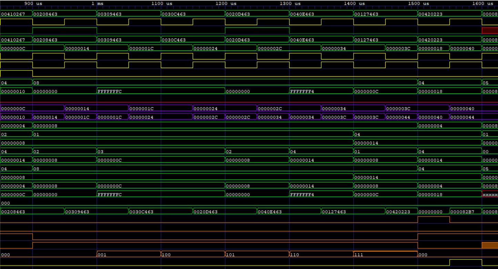

# Processador RISC-V 32I

Um processador 32-bits que implementa o ISA (Instruction Set Architecture) RISC-V 32I descrito em Verilog. Este processador foi testado por meio de Testbenches, análise de diagramas temporais e análise de memória.

# Descrição

O processador foi feito seguindo o ISA RISC-V 32I tendo palavras de 32 bits, e executando operações aritméticas apenas com números inteiros. Além das operações, também é capaz de executar todas as intruções da ISA, como *Branches, Jumps, Loads e Stores*, apenas não executando as instruções de manipulação de *CSR* (Control and Status Registers), pois os mesmos não se encaixam no escopo do projeto

- [ ] TODO IMAGEM CIRCUITO TODO

# Compilação

Para realizar a compilação dos arquivos verilog, é primeiro criado a pasta work e em seguida os arquivos são compilados utilizando `vlog <caminho ao arquivo>` presente na ferramenta Questa, e para realizar a simulação de algum Testbench, utilizamos `vsim -c work.<Nome do módulo a ser executado>`. Também é possível utilizar a *makefile* presente neste projeto, para facilitação a compilação de um grande número de arquivos verilog. Para realizar a geração de arquivos *waveform* (.vcd) também é necessário algumas flags de compilação como `-incr` e `+acc`

> Exemplo de compilação de um arquivo
> ~~~
> vlog -incr +acc src/cpu/ALU/ALU_mod.v
> ~~~

## Makefile
Este projeto contem uma makefile utilizada para compilar todos os arquivos verilog (exceto o arquivo de template) presentes no projeto. Esta ferramenta foi apenas testada no sistema operacional Windows, não sendo certa o seu funcionamento em outros ambientes.
## Comandos

~~~shell
make clear
~~~
Este comando é utilizado para limpar a pasta work, que contém códigos de erro e/ou arquivos compilados

~~~shell
make prepare
~~~
Este comando limpa a pasta work e automaticamente executa `vlib work` para refazer os arquivos perdidos antes da limpeza

~~~shell
make modules
~~~
Compila todos os arquivos terminados em mod.v, ou seja, compila apenas todos os módulos

~~~shell
make tests
~~~
Compila todos os arquivos terminados em test.v, ou seja, compila apenas testbenches

~~~shell
make all
~~~
compila todos os arquivos verilog, incluindo modulos e testbenchs.

# Execução
Para realizar a execução de um Testbench, basta compilar o arquivo junto com todas as suas depêndencias, e utilizar o simulador do terminal com o comando `vsim` juntamente com o nome do módulo de testbench
> Exemplo de simulação de um Testbench
> ~~~
> vsim -c work.ALU_TB
> ~~~
Ao executar o comando acima, basta digitar `run -all` que toda a simulação será executada e os arquivos serão gerados.

# Inspeção
Para realizar a inspeção de Testbenchs, são utilizadas 3 métodos: verificação por meio do terminal, verificação por timing diagram (arquivo .vcd) e verificação por análise de memória.  
A verificação pelo terminal é feita em módulos mais simples, e é simplesmente visualizada executando `run -all` dentro do ambiente de simulação, e inspecionando as saídas no terminal.  
>exemplo execução terminal  

A verificação por timing diagram é utilizada em módulos que contém um número elevado de sinais que torna inviável a utilização, nestes módulos, ao executor `run -all` no ambiente de simulação, é gerado um arquivo com extensão .vcd que pode ser abertos em algum software (foi utilizado o GTKWave) para a inspeção dos sinais.

>exemplo timing diagram  

A verificação por memória é feita apenas nas simulações da própria CPU, onde é gerado um arquivo RAMOUT.hex, que pode ser utilizado para verificar se, por exemplo, as variáveis utilizadas estão gravadas com os valores esperados.

- [ ] TODO imagem memória